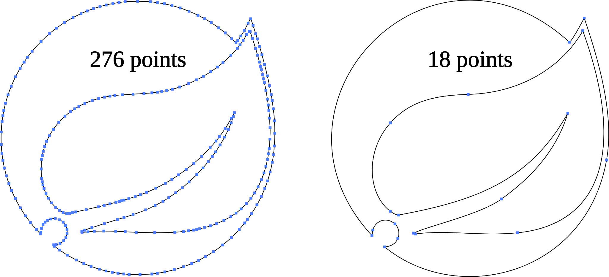

MFixx: Fixed MFizz icons
========================

<picture>
	<source alt="276 ⇒ 18 points" width="650" srcset="figure-1.svg#dark" media="(prefers-color-scheme: dark)"/>
	
</picture>

This is an optimised version of the [MFizz icon font](https://github.com/fizzed/font-mfizz/) produced for the [File-Icons package](https://github.com/file-icons/atom).
Enhancements include:

 * Normalised fitting and alignment
 
 * Removal of excess geometry to improve filesize

No visible details have been modified.  Credit for these icons belongs to [Fizzed](http://fizzed.com/) and the [Mfizz project's various contributors](https://github.com/fizzed/font-mfizz/graphs/contributors).

For an extended explanation on how the font's been optimised, consult the notes of [another font](https://github.com/file-icons/DevOpicons) that was patched for the File-Icons package.

**NOTE:**  
Icons that're already included in the [aforementioned font](https://github.com/file-icons/DevOpicons) have been excluded from MFixx, unless their details are visibly different.
You can find optimised versions of omitted icons [here](https://github.com/file-icons/DevOpicons/tree/master/svg).
